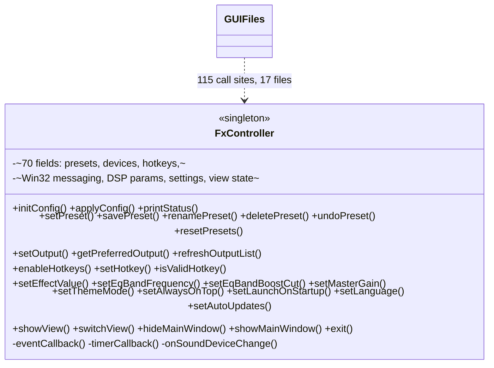
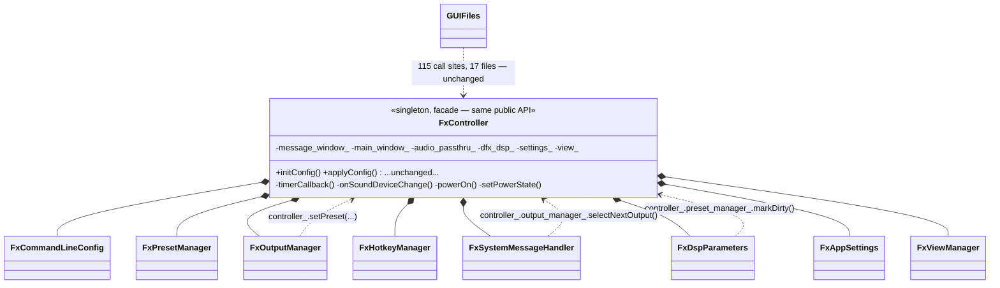

# FxController Decomposition Implementation Plan

> **For agentic workers:** REQUIRED SUB-SKILL: Use superpowers:subagent-driven-development (recommended) or superpowers:executing-plans to implement this plan task-by-task. Steps use checkbox (`- [ ]`) syntax for tracking.

**Goal:** Split the ~2,700-line `FxController` god-object (`fxsound/Source/GUI/FxController.{h,cpp}`) into eight focused collaborator classes, without changing `FxController`'s public API — so none of the 115 call sites across 17 other GUI files need to change.

**Architecture:** `FxController` keeps its full public method list (unchanged signatures) and stays the sole `Timer`/`AudioPassthruCallback` implementer JUCE requires. Every public method's body becomes a one-line delegation to a newly owned collaborator object. Collaborators are declared `friend class` of `FxController` so they can reach FxController's remaining *shared* resources (`main_window_`, `system_tray_view_`, `audio_passthru_`, `dfx_dsp_`, `settings_`, `message_window_`, `view_`, `output_changed_`, the `audio_process_*` timer-state cluster) exactly as the original monolith did. Cross-subsystem calls (e.g. output selection triggering a preset switch) go through `FxController`'s stable public methods (`controller_.setPreset(...)`), never by reaching into a sibling manager's internals — no manager is a friend of another manager.

**Tech Stack:** C++17, JUCE 6.1.6, Visual Studio 2022 / MSBuild, Projucer-generated `.vcxproj`/`.jucer` project files (hand-edited per `CLAUDE.md`'s note on the Projucer export quirk).

**Spec:** No separate spec file — this is a bounded, internals-only refactor (public API frozen) scoped and approved in chat on 2026-09-18. This plan is the authoritative design record.

## Global Constraints

- `FxController`'s public method signatures in `fxsound/Source/GUI/FxController.h` must not change. Public static constants (`HK_CMD_*`, `CMD_*`, `DEFAULT_*`, `MIN_GAIN`, `MAX_GAIN`, `NUM_SPECTRUM_BANDS`) stay declared on `FxController` exactly where they are — several (`HK_CMD_*`) are referenced externally (`FxHotkeyLabel.cpp`, `FxAudioControls.cpp`, `FxGeneralSettingsPane.cpp`, `FxVisualizer.cpp`).
- The 8 new classes are internal collaborators of `FxController` only. No other file in the codebase includes or references them directly.
- Every new class is declared `friend class FxXxx;` inside `FxController`'s private section, and stores a `FxController& controller_` reference set in its constructor. Internal code (inside the 8 new `.cpp` files) accesses FxController's shared fields directly as `controller_.field_` (friend access) and calls FxController's business-logic methods as `controller_.method(...)` (public, stable regardless of extraction order).
- No behavioral change anywhere. Every relocated method's logic is copied verbatim from its current location (line numbers below refer to the file as it exists today, before any task in this plan runs) with only mechanical adjustments: unqualified field access `field_` becomes `controller_.field_` when the field stays shared on `FxController`, or stays unqualified when the field now lives directly on the new class as its own member.
- No unit test harness exists for `FxController` (confirmed: no `*Test*` files reference it anywhere in the repo). Verification per task is a clean MSBuild build of the `FxSound_App` project, Debug|x64 — this replaces the red/green TDD cycle for this refactor. Locate MSBuild via `vswhere`:
  ```
  "%ProgramFiles(x86)%\Microsoft Visual Studio\Installer\vswhere.exe" -latest -products * -requires Microsoft.Component.MSBuild -find MSBuild\**\Bin\MSBuild.exe
  ```
  Then build with:
  ```
  <path-to-MSBuild.exe> "D:\code\fxsound-app\fxsound\Project\FxSound.sln" /t:FxSound_App /p:Configuration=Debug /p:Platform=x64
  ```
- Every new `.h`/`.cpp` pair must be registered, in the same task that creates it, in all 6 checked-in project files: `fxsound/FxSound.jucer`, `fxsound/FxSoundARM.jucer`, `fxsound/Project/FxSound_App.vcxproj`, `fxsound/Project/FxSound_App.vcxproj.filters`, `fxsound/ProjectARM/FxSound_App.vcxproj`, `fxsound/ProjectARM/FxSound_App.vcxproj.filters`. New files go in the existing "Controller" group/filter (`FxSound\Source\GUI\Controller`) alongside `FxController.cpp`/`.h` — do not invent a new group.
- Running the app end-to-end is not possible in this environment without FxSound's installed virtual audio driver (per `CLAUDE.md`); verification is build-only plus manual code review, not runtime testing.
- Commit after each task with a `refactor(controller): extract FxXxx` style message.

---

## Before / After





---

## Task 1: Extract FxCommandLineConfig

**Files:**
- Create: `fxsound/Source/GUI/FxCommandLineConfig.h`
- Create: `fxsound/Source/GUI/FxCommandLineConfig.cpp`
- Modify: `fxsound/Source/GUI/FxController.h`
- Modify: `fxsound/Source/GUI/FxController.cpp`
- Modify: `fxsound/FxSound.jucer`, `fxsound/FxSoundARM.jucer`, `fxsound/Project/FxSound_App.vcxproj(.filters)`, `fxsound/ProjectARM/FxSound_App.vcxproj(.filters)`

**Interfaces:**
- Produces: `FxCommandLineConfig::initConfig(const String&)`, `applyConfig(const String&)`, `printStatus()`, `static File getStatusFile()` — all public.
- Consumes: `FxController`'s stable public API (`setPowerState`, `setPreset`, `setOutput`, `setOutputName`, `setNumEqBands`, `setVolumeLeveling`, `setBalance`, `setFilterQ`, `setMasterGain`, `setEffectValue`, `setEqBandFrequency`, `setEqBandBoostCut`, `getNumEqBands`, `getEqBandFrequency`, `getEqBandBoostCut`, `getEffectValue`, `getMasterGain`, `getVolumeLeveling`, `getFilterQ`, `getBalance`, `getOutputName`, `showView`, `showMainWindow`, `hideMainWindow`, `getCurrentView`) plus friend access to `controller_.settings_`, `controller_.audio_passthru_`, `controller_.main_window_`.

- [ ] **Step 1: Create `FxCommandLineConfig.h`**

```cpp
/*
FxSound
Copyright (C) 2025  FxSound LLC
This program is free software: you can redistribute it and/or modify
it under the terms of the GNU Affero General Public License as published by
the Free Software Foundation, either version 3 of the License, or
(at your option) any later version.
*/

#pragma once

#include <JuceHeader.h>

class FxController;

class FxCommandLineConfig
{
public:
    explicit FxCommandLineConfig(FxController& controller) : controller_(controller) {}

    void initConfig(const String& commandline);
    void applyConfig(const String& commandline);
    void printStatus();
    static File getStatusFile();

private:
    FxController& controller_;

    JUCE_DECLARE_NON_COPYABLE_WITH_LEAK_DETECTOR(FxCommandLineConfig)
};
```

- [ ] **Step 2: Create `FxCommandLineConfig.cpp`**

Move the bodies of `FxController::initConfig` (current lines 222-343), `FxController::applyConfig` (345-603, including the `sanitizePresetName` lambda at 378-392), `FxController::getStatusFile` (605-608) and `FxController::printStatus` (610-695) verbatim into this file as `FxCommandLineConfig::` members. Add `#include "FxCommandLineConfig.h"`, `#include "FxController.h"`, `#include "FxMainWindow.h"`, `#include "FxSystemTrayView.h"`, `#include "AudioPassthru.h"` at the top.

Mechanical text changes required in the moved code:
- Every unqualified call to a `FxController` public method (e.g. `setPowerState(...)`, `setPreset(...)`, `setOutput(...)`, `setNumEqBands(...)`, `showView()`, `showMainWindow()`, `hideMainWindow()`) becomes `controller_.setPowerState(...)` etc.
- `settings_.setBool(...)` / `settings_.setInt(...)` / `settings_.setString(...)` / `settings_.getInt(...)` / `settings_.getDouble(...)` / `settings_.getString(...)` becomes `controller_.settings_....`
- `view_` (read in the `--view` branches — note: `applyConfig`'s view branch calls `showView()` which reads `view_` internally, but `applyConfig` itself also directly assigns `view_ = static_cast<ViewType>(value);` at two places) becomes `controller_.view_ = ...`.
- `audio_passthru_->getSoundDevices()` (in `applyConfig`'s `--output` handling and in `printStatus`) becomes `controller_.audio_passthru_->getSoundDevices()`.
- `main_window_->update()` (in `applyConfig`, three places after band_freq/band_gain/effect parsing) becomes `controller_.main_window_->update()`.
- `getSettingsFile()`... n/a. `getStatusFile()` calls inside `printStatus` stay unqualified (same class, static method).
- `model.isPresetNameValid`, `model.getUserPresetCount`, `model.getPreset`, `model.getSelectedPreset`, `model.isPresetModified`, `model.getPowerState`, `model.getPresetCount` — `FxModel::getModel()` is a free-standing global singleton, unchanged, no qualification needed.

- [ ] **Step 3: Update `FxController.h`**

In the private section, add (near the top, after the `MessageWindow` class):
```cpp
friend class FxCommandLineConfig;
```
Add a member (in the private section, after `audio_passthru_`):
```cpp
FxCommandLineConfig command_line_config_;
```
Include the header near the top: `#include "FxCommandLineConfig.h"`.

Delete the now-unused private declarations: none of `initConfig`/`applyConfig`/`printStatus`/`getStatusFile` were private before (they're all public) — leave their public declarations exactly as-is; only their *implementations* move.

- [ ] **Step 4: Update `FxController.cpp`**

Replace the bodies of `initConfig`, `applyConfig`, `printStatus`, `getStatusFile` with one-line delegations:
```cpp
void FxController::initConfig(const String& commandline)
{
    command_line_config_.initConfig(commandline);
}

void FxController::applyConfig(const String& commandline)
{
    command_line_config_.applyConfig(commandline);
}

File FxController::getStatusFile()
{
    return FxCommandLineConfig::getStatusFile();
}

void FxController::printStatus()
{
    command_line_config_.printStatus();
}
```
Add `command_line_config_(*this)` to `FxController`'s constructor member-initializer list (order: after `audio_passthru_(nullptr)` is set in the body — since it's a body assignment not an initializer, just add `command_line_config_(*this)` anywhere in the initializer list; `#include "FxCommandLineConfig.h"` is already pulled via the header).

- [ ] **Step 5: Register the new files in all 6 project files**

In `fxsound/FxSound.jucer`, inside the `<GROUP id="{FBD61171-43D0-1152-4B75-F146482E62D3}" name="Controller">` block, add before the closing `</GROUP>`:
```xml
<FILE id="a1B2c3" name="FxCommandLineConfig.cpp" compile="1" resource="0"
      file="Source/GUI/FxCommandLineConfig.cpp"/>
<FILE id="d4E5f6" name="FxCommandLineConfig.h" compile="0" resource="0" file="Source/GUI/FxCommandLineConfig.h"/>
```
(Generate fresh unique 6-char alphanumeric `id` values, distinct from all existing ids in the file — do not reuse `a1B2c3`/`d4E5f6` literally.)

Do the identical edit in `fxsound/FxSoundARM.jucer`'s matching `Controller` group.

In `fxsound/Project/FxSound_App.vcxproj`, add after the `FxController.cpp` line:
```xml
    <ClCompile Include="..\Source\GUI\FxCommandLineConfig.cpp" />
```
and after the `FxController.h` line:
```xml
    <ClInclude Include="..\Source\GUI\FxCommandLineConfig.h" />
```

In `fxsound/Project/FxSound_App.vcxproj.filters`, add after the `FxController.cpp` entry:
```xml
    <ClCompile Include="..\Source\GUI\FxCommandLineConfig.cpp">
      <Filter>FxSound\Source\GUI\Controller</Filter>
    </ClCompile>
```
and after the `FxController.h` entry:
```xml
    <ClInclude Include="..\Source\GUI\FxCommandLineConfig.h">
      <Filter>FxSound\Source\GUI\Controller</Filter>
    </ClInclude>
```

Repeat both `vcxproj`/`vcxproj.filters` edits identically in `fxsound/ProjectARM/FxSound_App.vcxproj` and `fxsound/ProjectARM/FxSound_App.vcxproj.filters`.

- [ ] **Step 6: Build**

Run the MSBuild command from Global Constraints. Expected: build succeeds with no new errors/warnings. Fix any missing-include or qualification mistakes surfaced by the compiler.

- [ ] **Step 7: Commit**

```bash
git add fxsound/Source/GUI/FxCommandLineConfig.h fxsound/Source/GUI/FxCommandLineConfig.cpp fxsound/Source/GUI/FxController.h fxsound/Source/GUI/FxController.cpp fxsound/FxSound.jucer fxsound/FxSoundARM.jucer fxsound/Project/FxSound_App.vcxproj fxsound/Project/FxSound_App.vcxproj.filters fxsound/ProjectARM/FxSound_App.vcxproj fxsound/ProjectARM/FxSound_App.vcxproj.filters
git commit -m "refactor(controller): extract FxCommandLineConfig"
```

---

## Task 2: Extract FxHotkeyManager

**Files:**
- Create: `fxsound/Source/GUI/FxHotkeyManager.h`, `fxsound/Source/GUI/FxHotkeyManager.cpp`
- Modify: `FxController.h`, `FxController.cpp`, and the 6 project files (same registration pattern as Task 1, filenames `FxHotkeyManager.h`/`.cpp`).

**Interfaces:**
- Produces: `enableHotkeys(bool)`, `getHotkey(String, int&, int&)`, `setHotkey(const String&, int, int)`, `isValidHotkey(int, int)`, `registerHotkeys()`, `unregisterHotkeys()` — all public.
- Consumes: `controller_.message_window_.getHandle()` (friend), `controller_.settings_` (friend), `FxModel::getModel()` (global), `FxController::HK_CMD_*` and `FxController::CMD_*` (public/private static constants on `FxController`, accessible by name since `FxHotkeyManager` is a friend).

- [ ] **Step 1: Create `FxHotkeyManager.h`**

```cpp
#pragma once

#include <JuceHeader.h>

class FxController;

class FxHotkeyManager
{
public:
    explicit FxHotkeyManager(FxController& controller) : controller_(controller) {}
    ~FxHotkeyManager() { unregisterHotkeys(); }

    void enableHotkeys(bool enable);
    bool getHotkey(String cmdKey, int& mod, int& vk);
    bool setHotkey(const String& command, int new_mod, int new_vk);
    bool isValidHotkey(int mod, int vk);
    void registerHotkeys();
    void unregisterHotkeys();

private:
    FxController& controller_;
    bool hotkeys_registered_ = false;

    JUCE_DECLARE_NON_COPYABLE_WITH_LEAK_DETECTOR(FxHotkeyManager)
};
```

- [ ] **Step 2: Create `FxHotkeyManager.cpp`**

Move `FxController::enableHotkeys` (2163-2175), `getHotkey` (2177-2191), `setHotkey` (2193-2270), `isValidHotkey` (2272-2301), `registerHotkeys` (2595-2647), `unregisterHotkeys` (2649-2660) verbatim, renamed to `FxHotkeyManager::`. Text changes:
- `settings_.setBool(...)`/`getInt(...)` → `controller_.settings_....`
- `FxModel::getModel().setHotkeySupport(enable)` — unchanged (global singleton).
- `::RegisterHotKey(message_window_.getHandle(), ...)` / `::UnregisterHotKey(message_window_.getHandle(), ...)` → `message_window_` becomes `controller_.message_window_`.
- References to `CMD_ON_OFF`, `CMD_OPEN_CLOSE`, `CMD_NEXT_PRESET`, `CMD_PREVIOUS_PRESET`, `CMD_NEXT_OUTPUT` become `FxController::CMD_ON_OFF` etc. (private static constants on `FxController`, reachable because `FxHotkeyManager` is a friend).
- `hotkeys_registered_` stays unqualified (now `FxHotkeyManager`'s own member).
- `HK_CMD_*` string constants become `FxController::HK_CMD_ON_OFF` etc. (already public on `FxController`).

- [ ] **Step 3: Update `FxController.h`**

Add `friend class FxHotkeyManager;` and member `FxHotkeyManager hotkey_manager_;`. Remove the now-dead private members `hotkeys_registered_` (moved) — leave `CMD_ON_OFF`..`CMD_NEXT_OUTPUT` and `HK_CMD_*` declared exactly where they are (still needed by `FxHotkeyManager` via friend access and externally, respectively). Remove the private method declarations `registerHotkeys()`/`unregisterHotkeys()` since only `FxHotkeyManager` and `FxController`'s own constructor/destructor need them now — replace with calls to `hotkey_manager_.registerHotkeys()`/`hotkey_manager_.unregisterHotkeys()` (see Step 4). Keep `enableHotkeys`, `getHotkey`, `setHotkey`, `isValidHotkey` declared in the public section unchanged.

- [ ] **Step 4: Update `FxController.cpp`**

Replace bodies:
```cpp
void FxController::enableHotkeys(bool enable) { hotkey_manager_.enableHotkeys(enable); }
bool FxController::getHotkey(String cmdKey, int& mod, int& vk) { return hotkey_manager_.getHotkey(cmdKey, mod, vk); }
bool FxController::setHotkey(const String& command, int new_mod, int new_vk) { return hotkey_manager_.setHotkey(command, new_mod, new_vk); }
bool FxController::isValidHotkey(int mod, int vk) { return hotkey_manager_.isValidHotkey(mod, vk); }
```
In the constructor body, change the existing hotkey-support block (current lines 183-188) so `registerHotkeys();` becomes `hotkey_manager_.registerHotkeys();`. In the destructor body, change `unregisterHotkeys();` (current line 218) to `hotkey_manager_.unregisterHotkeys();` — note `~FxHotkeyManager()` also calls it, so this explicit call becomes redundant defense-in-depth; keep it anyway to preserve the exact original destructor statement order (harmless double-call guarded by `hotkeys_registered_`). Add `hotkey_manager_(*this)` to the constructor's member-initializer list. Delete the standalone `FxController::registerHotkeys()`/`FxController::unregisterHotkeys()` definitions (now living in `FxHotkeyManager.cpp`).

- [ ] **Step 5: Register in the 6 project files** — same pattern as Task 1, Step 5, with `FxHotkeyManager.h`/`.cpp`.

- [ ] **Step 6: Build** — per Global Constraints.

- [ ] **Step 7: Commit** — `refactor(controller): extract FxHotkeyManager`.

---

## Task 3: Extract FxSystemMessageHandler

**Files:**
- Create: `fxsound/Source/GUI/FxSystemMessageHandler.h`, `.cpp`
- Modify: `FxController.h`, `FxController.cpp`, the 6 project files.

**Interfaces:**
- Produces: `static LRESULT CALLBACK eventCallback(HWND, UINT, WPARAM, LPARAM)`, `void registerForSystemNotifications()`, `void registerPowerNotify()`, `void unregisterPowerNotify()`, `void unregisterSessionNotification()` — all public.
- Consumes: friend access to `controller_.message_window_`, `controller_.main_window_`, `controller_.audio_passthru_`, `controller_.settings_`, `controller_.active_output_devices_` (still on `FxController` at this point — will be updated in Task 8 once it moves), `FxController::CMD_*`; calls `controller->setPowerState`, `controller->hideMainWindow`, `controller->showMainWindow`, `controller->setPreset`, `controller->setOutput`, `controller->powerOn` (private — friend), `controller->settings_.getBool("power")`.

- [ ] **Step 1: Create `FxSystemMessageHandler.h`**

```cpp
#pragma once

#include <JuceHeader.h>
#include <windows.h>
#include <wtsapi32.h>

class FxController;

class FxSystemMessageHandler
{
public:
    explicit FxSystemMessageHandler(FxController& controller) : controller_(controller) {}

    static LRESULT CALLBACK eventCallback(HWND hwnd, const UINT message, const WPARAM w_param, const LPARAM l_param);

    void registerForSystemNotifications();
    void registerPowerNotify();
    void unregisterPowerNotify();
    void unregisterSessionNotification();

private:
    void onSystemSuspend();
    void onSystemResume();

    typedef HPOWERNOTIFY(WINAPI* RegisterSuspendResumeNotificationFunc)(HANDLE, DWORD);
    typedef BOOL(WINAPI* UnregisterSuspendResumeNotificationFunc)(HPOWERNOTIFY);

    FxController& controller_;
    DWORD session_id_ = 0;
    HPOWERNOTIFY powerNotify_ = nullptr;
    UnregisterSuspendResumeNotificationFunc unregister_suspend_resume_notification_ = nullptr;

    JUCE_DECLARE_NON_COPYABLE_WITH_LEAK_DETECTOR(FxSystemMessageHandler)
};
```

- [ ] **Step 2: Create `FxSystemMessageHandler.cpp`**

Move `FxController::eventCallback` (1917-2051), `onSystemSuspend` (2146-2152), `onSystemResume` (2154-2160) verbatim as `FxSystemMessageHandler::` members (the two `on*` methods become `private`, called only from `eventCallback`, which is itself this class's own static member, so `controller->system_message_handler_.onSystemSuspend()` inside the `WM_POWERBROADCAST` case is legal — a class calling its own private method on another instance of the same class). Text changes:
- `FxController* controller = (FxController*)GetWindowLongPtr(hwnd, GWLP_USERDATA);` — unchanged (still casts to `FxController*`; GWLP_USERDATA still stores the `FxController*`, see Step 4).
- `controller->onSystemSuspend()` / `controller->onSystemResume()` become `controller->system_message_handler_.onSystemSuspend()` / `...onSystemResume()` (friend access to the private member `system_message_handler_`, then calling its own class's private method — legal).
- Inside `onSystemSuspend`/`onSystemResume` (now members of this class taking no controller param since they operate on `controller_`): `FxModel::getModel().getPowerState()` unchanged; `audio_passthru_->mute(...)` becomes `controller_.audio_passthru_->mute(...)`.
- `controller->powerOn(false)` (in the `WM_WTSSESSION_CHANGE` case) stays as `controller->powerOn(false)` — `powerOn` is private on `FxController`; `FxSystemMessageHandler` is a friend of `FxController`, so this compiles.
- `controller->settings_.getBool("power")` stays as `controller->settings_.getBool("power")` (friend access).
- `controller->active_output_devices_` (in `WM_HOTKEY`'s `CMD_NEXT_OUTPUT` branch) stays as-is for now (friend access, field still lives on `FxController` until Task 8).
- `CMD_ON_OFF`, `CMD_OPEN_CLOSE`, `CMD_NEXT_PRESET`, `CMD_PREVIOUS_PRESET`, `CMD_NEXT_OUTPUT` become `FxController::CMD_ON_OFF` etc.

Add three new methods (new code, not relocated):
```cpp
void FxSystemMessageHandler::registerForSystemNotifications()
{
    session_id_ = 0;
    ProcessIdToSessionId(GetCurrentProcessId(), &session_id_);
    SetWindowLongPtr(controller_.message_window_.getHandle(), GWLP_USERDATA, (LONG_PTR)&controller_);
    WTSRegisterSessionNotification(controller_.message_window_.getHandle(), NOTIFY_FOR_THIS_SESSION);
}

void FxSystemMessageHandler::registerPowerNotify()
{
    HMODULE user32_module = GetModuleHandleW(L"user32.dll");
    if (user32_module != nullptr)
    {
        auto register_suspend_resume_notification = reinterpret_cast<RegisterSuspendResumeNotificationFunc>(
            GetProcAddress(user32_module, "RegisterSuspendResumeNotification"));
        unregister_suspend_resume_notification_ = reinterpret_cast<UnregisterSuspendResumeNotificationFunc>(
            GetProcAddress(user32_module, "UnregisterSuspendResumeNotification"));

        if (register_suspend_resume_notification != nullptr && unregister_suspend_resume_notification_ != nullptr)
        {
            powerNotify_ = register_suspend_resume_notification(controller_.message_window_.getHandle(), DEVICE_NOTIFY_WINDOW_HANDLE);
        }
    }
}

void FxSystemMessageHandler::unregisterPowerNotify()
{
    if (powerNotify_ != nullptr && unregister_suspend_resume_notification_ != nullptr)
    {
        unregister_suspend_resume_notification_(powerNotify_);
        powerNotify_ = nullptr;
    }
}

void FxSystemMessageHandler::unregisterSessionNotification()
{
    WTSUnRegisterSessionNotification(controller_.message_window_.getHandle());
}
```
These are exact transcriptions of the logic currently inline in `FxController`'s constructor (lines 202-206), `init()` (lines 788-800), and destructor (lines 211-217) respectively — see Step 4.

- [ ] **Step 3: Update `FxController.h`**

Add `friend class FxSystemMessageHandler;` and member `FxSystemMessageHandler system_message_handler_;`. Remove the private members `powerNotify_`, `unregister_suspend_resume_notification_`, `session_id_`, and the private method declarations `onSystemSuspend()`, `onSystemResume()` (all moved). The static `eventCallback` declaration on `FxController` is removed too — `message_window_`'s constructor argument changes (see Step 4). Keep `message_window_` itself and the `RegisterSuspendResumeNotificationFunc`/`UnregisterSuspendResumeNotificationFunc` typedefs can be deleted from `FxController.h` (they now live only in `FxSystemMessageHandler.h`).

- [ ] **Step 4: Update `FxController.cpp`**

Constructor: change
```cpp
FxController::FxController() : message_window_(L"FxSoundHotkeys", (WNDPROC)eventCallback)
```
to
```cpp
FxController::FxController() : message_window_(L"FxSoundHotkeys", (WNDPROC)FxSystemMessageHandler::eventCallback)
```
Delete the constructor-body lines that set `powerNotify_ = nullptr;` and `unregister_suspend_resume_notification_ = nullptr;` (now default-initialized on `FxSystemMessageHandler`). Replace the constructor-body block (current lines 202-206: `SetWindowLongPtr(...)`, `session_id_ = 0;`, `ProcessIdToSessionId(...)`, `WTSRegisterSessionNotification(...)`) with a single call:
```cpp
system_message_handler_.registerForSystemNotifications();
```
Add `system_message_handler_(*this)` to the constructor's member-initializer list.

In `FxController::init()`, replace the current lines 788-800 (the `user32_module` GetProcAddress block) with:
```cpp
system_message_handler_.registerPowerNotify();
```

Destructor: replace
```cpp
if (powerNotify_ != nullptr && unregister_suspend_resume_notification_ != nullptr)
{
    unregister_suspend_resume_notification_(powerNotify_);
    powerNotify_ = nullptr;
}
stopTimer();
WTSUnRegisterSessionNotification(message_window_.getHandle());
unregisterHotkeys();
```
with
```cpp
system_message_handler_.unregisterPowerNotify();
stopTimer();
system_message_handler_.unregisterSessionNotification();
hotkey_manager_.unregisterHotkeys();
```
Delete the standalone `FxController::eventCallback`, `onSystemSuspend`, `onSystemResume` definitions (now in `FxSystemMessageHandler.cpp`). Add `#include "FxSystemMessageHandler.h"` near the top.

- [ ] **Step 5: Register in the 6 project files** — same pattern, `FxSystemMessageHandler.h`/`.cpp`.

- [ ] **Step 6: Build** — per Global Constraints.

- [ ] **Step 7: Commit** — `refactor(controller): extract FxSystemMessageHandler`.

---

## Task 4: Extract FxAppSettings

**Files:**
- Create: `fxsound/Source/GUI/FxAppSettings.h`, `.cpp`
- Modify: `FxController.h`, `FxController.cpp`, the 6 project files.

**Interfaces:**
- Produces: `loadFromSettings()`, `isHelpTooltipsHidden()`, `setHelpTooltipsHidden(bool)`, `isNotificationsHidden()`, `setNotificationsHidden(bool)`, `getLanguage() const`, `setLanguage(String)`, `getMaxUserPresets() const`, `getAutoUpdates()`, `setAutoUpdates(bool)`, `checkUpdates()`, `saveWindowPosition(int,int)`, `getWindowPosition(int&,int&)`, `getThemeMode()`, `setThemeMode(FxThemeMode)`, `isAlwaysOnTop()`, `setAlwaysOnTop(bool)`, `isLaunchOnStartup()`, `setLaunchOnStartup(bool)` — all public.
- Consumes: friend access to `controller_.settings_`, `controller_.main_window_`, `controller_.system_tray_view_`; calls `controller_.isAudioProcessing()` (public, stays on `FxController`), `controller_.sendLookAndFeelChange` via `controller_.main_window_->sendLookAndFeelChange()`.

- [ ] **Step 1: Create `FxAppSettings.h`**

```cpp
#pragma once

#include <JuceHeader.h>
#include "FxTheme.h"

class FxController;

class FxAppSettings
{
public:
    explicit FxAppSettings(FxController& controller) : controller_(controller) {}

    void loadFromSettings();

    bool isHelpTooltipsHidden();
    void setHelpTooltipsHidden(bool status);
    bool isNotificationsHidden();
    void setNotificationsHidden(bool status);
    String getLanguage() const;
    void setLanguage(String language_code);
    int getMaxUserPresets() const;
    bool getAutoUpdates();
    void setAutoUpdates(bool enable);
    void checkUpdates();
    void saveWindowPosition(int x, int y);
    void getWindowPosition(int& x, int& y);
    FxThemeMode getThemeMode();
    void setThemeMode(FxThemeMode mode);
    bool isAlwaysOnTop();
    void setAlwaysOnTop(bool always_on_top);
    bool isLaunchOnStartup();
    void setLaunchOnStartup(bool launch_on_startup);

private:
    FxController& controller_;
    bool always_on_top_ = false;
    bool hide_help_tooltips_ = false;
    bool hide_notifications_ = false;
    bool auto_updates_ = true;
    String language_;
    int max_user_presets_ = 120;

    JUCE_DECLARE_NON_COPYABLE_WITH_LEAK_DETECTOR(FxAppSettings)
};
```

- [ ] **Step 2: Create `FxAppSettings.cpp`**

Move verbatim, renamed to `FxAppSettings::`: `isHelpTooltipsHidden` (2303-2306), `setHelpTooltipsHidden` (2308-2313), `isNotificationsHidden` (2315-2318), `setNotificationsHidden` (2320-2324), `getLanguage` (2326-2329), `setLanguage` (2331-2369), `getMaxUserPresets` (2371-2374), `getAutoUpdates` (2376-2379), `setAutoUpdates` (2381-2385), `checkUpdates` (2387-2402), `saveWindowPosition` (2404-2408), `getWindowPosition` (2410-2414), `getThemeMode` (2530-2533), `setThemeMode` (2535-2550), `isAlwaysOnTop` (2552-2555), `setAlwaysOnTop` (2557-2562), `isLaunchOnStartup` (2564-2574), `setLaunchOnStartup` (2576-2593).

Text changes:
- `settings_.set*/get*` → `controller_.settings_....`
- `main_window_->repaint()` (in `setHelpTooltipsHidden`) → `controller_.main_window_->repaint()`.
- `isAudioProcessing()` (in `checkUpdates`) → `controller_.isAudioProcessing()` (public, stays on `FxController`).
- `main_window_->sendLookAndFeelChange()`, `main_window_->setIcon(...)`, `main_window_->setAlwaysOnTop(...)` → `controller_.main_window_->...`.
- `system_tray_view_->setStatus(...)` (in `setThemeMode`) → `controller_.system_tray_view_->setStatus(...)`.
- `FxModel::getModel().getPowerState()` unchanged (global).
- `setLanguage`'s `audio_process_on_` reference — check: `setThemeMode` uses `audio_process_on_` for the icon/status refresh; this field stays on `FxController`, so it becomes `controller_.audio_process_on_`.
- `setLanguage`'s loop over `Desktop::getInstance()` components — unchanged, no controller state touched.

Add:
```cpp
void FxAppSettings::loadFromSettings()
{
    always_on_top_ = controller_.settings_.getBool("always_on_top");
    hide_help_tooltips_ = controller_.settings_.getBool("hide_help_tooltips");
    hide_notifications_ = controller_.settings_.getBool("hide_notifications");
    auto_updates_ = controller_.settings_.getBool("automatic_updates", true);
    max_user_presets_ = controller_.settings_.getInt("max_user_presets");
    if (max_user_presets_ < 10 || max_user_presets_ > 120)
    {
        controller_.settings_.setInt("max_user_presets", 120);
        max_user_presets_ = 120;
    }
}
```
This is an exact transcription of the current constructor lines 191-200.

- [ ] **Step 3: Update `FxController.h`**

Add `friend class FxAppSettings;` and member `FxAppSettings app_settings_;`. Remove private fields `always_on_top_`, `hide_help_tooltips_`, `hide_notifications_`, `auto_updates_`, `language_`, `max_user_presets_`. Keep all the public method declarations unchanged.

- [ ] **Step 4: Update `FxController.cpp`**

Replace each moved method's body with a one-line delegation, e.g.:
```cpp
bool FxController::isHelpTooltipsHidden() { return app_settings_.isHelpTooltipsHidden(); }
void FxController::setHelpTooltipsHidden(bool status) { app_settings_.setHelpTooltipsHidden(status); }
// ...and so on for every method listed in Step 2's move list, same pattern.
```
In the constructor body, replace current lines 191-200 with `app_settings_.loadFromSettings();`. Add `app_settings_(*this)` to the member-initializer list. Delete the standalone old definitions.

- [ ] **Step 5: Register in the 6 project files** — same pattern, `FxAppSettings.h`/`.cpp`.

- [ ] **Step 6: Build** — per Global Constraints.

- [ ] **Step 7: Commit** — `refactor(controller): extract FxAppSettings`.

---

## Task 5: Extract FxViewManager

**Files:**
- Create: `fxsound/Source/GUI/FxViewManager.h`, `.cpp`
- Modify: `FxController.h`, `FxController.cpp`, the 6 project files.

**Interfaces:**
- Produces: `showView()`, `switchView()`, `getCurrentView()`, `hideMainWindow()`, `showMainWindow()`, `isMainWindowVisible()`, `getMainWindow()`, `getSystemTrayWindowPosition(int,int)`, `exit()` — all public.
- Consumes: friend access to `controller_.main_window_`, `controller_.system_tray_view_`, `controller_.settings_`, `controller_.view_`; calls `controller_.autoSaveModifiedPreset()` (public, stable) inside `exit()`.

- [ ] **Step 1: Create `FxViewManager.h`**

```cpp
#pragma once

#include <JuceHeader.h>

class FxController;
class FxWindow;

class FxViewManager
{
public:
    explicit FxViewManager(FxController& controller) : controller_(controller) {}

    void showView();
    void switchView();
    ViewType getCurrentView();
    void hideMainWindow();
    void showMainWindow();
    bool isMainWindowVisible();
    FxWindow* getMainWindow();
    Point<int> getSystemTrayWindowPosition(int width, int height);
    bool exit();

private:
    FxController& controller_;
    bool minimize_tip_ = true;
    bool survey_tip_ = false;
    bool authenticated_ = true;

    JUCE_DECLARE_NON_COPYABLE_WITH_LEAK_DETECTOR(FxViewManager)
};
```

- [ ] **Step 2: Create `FxViewManager.cpp`**

Move verbatim, renamed to `FxViewManager::`: `showView` (879-889), `switchView` (891-905), `getCurrentView` (907-910), `hideMainWindow` (912-928), `showMainWindow` (930-964), `isMainWindowVisible` (966-974), `getMainWindow` (982-985), `getSystemTrayWindowPosition` (987-990), `exit` (999-1006).

Text changes:
- `view_` → `controller_.view_` everywhere (shared field).
- `settings_.setInt("view", ...)`, `settings_.setBool("run_minimized", ...)`, `settings_.getInt("survey_timer")`, `settings_.setInt("survey_timer", ...)`, `settings_.setBool("survey_displayed", true)` → `controller_.settings_....`
- `main_window_->showProView()`, `->showLiteView()`, `->removeFromDesktop()`, `->setVisible(false)`, `->show()`, `->setIcon(...)`, `->isOnDesktop()`, `->isVisible()` → `controller_.main_window_->...`.
- `system_tray_view_->getSystemTrayWindowPosition(...)` → `controller_.system_tray_view_->...`.
- `FxModel::getModel().getPowerState()`, `.pushMessage(...)` unchanged (global).
- `autoSaveModifiedPreset()` (in `exit`) → `controller_.autoSaveModifiedPreset()` (public, stable).
- `JUCEApplication::getInstance()->systemRequestedQuit()` (in `exit`) unchanged.
- `authenticated_` reference inside `showMainWindow`'s survey-tip branch stays unqualified (now this class's own member).

- [ ] **Step 3: Update `FxController.h`**

Add `friend class FxViewManager;` and member `FxViewManager view_manager_;`. Remove private fields `minimize_tip_`, `survey_tip_`, `authenticated_`. Keep `view_` itself on `FxController` (shared — `FxCommandLineConfig` also writes it). Keep public method declarations unchanged.

- [ ] **Step 4: Update `FxController.cpp`**

Replace bodies with delegations:
```cpp
void FxController::showView() { view_manager_.showView(); }
void FxController::switchView() { view_manager_.switchView(); }
ViewType FxController::getCurrentView() { return view_manager_.getCurrentView(); }
void FxController::hideMainWindow() { view_manager_.hideMainWindow(); }
void FxController::showMainWindow() { view_manager_.showMainWindow(); }
bool FxController::isMainWindowVisible() { return view_manager_.isMainWindowVisible(); }
FxWindow* FxController::getMainWindow() { return view_manager_.getMainWindow(); }
Point<int> FxController::getSystemTrayWindowPosition(int width, int height) { return view_manager_.getSystemTrayWindowPosition(width, height); }
bool FxController::exit() { return view_manager_.exit(); }
```
In the constructor body, delete `authenticated_ = true;` and `minimize_tip_ = true;` (current line 129/131 — `dfx_enabled_ = true;` on that same line stays for now, moves in Task 8). In `init()`, replace the `survey_tip_ = !settings_.getBool("survey_displayed");` line (773) with `view_manager_.setSurveyTipFromSettings();` — add this small new method:
```cpp
void FxViewManager::setSurveyTipFromSettings()
{
    survey_tip_ = !controller_.settings_.getBool("survey_displayed");
}
```
(declare it public in `FxViewManager.h` alongside the others). Add `view_manager_(*this)` to the constructor's member-initializer list. Delete the standalone old definitions.

- [ ] **Step 5: Register in the 6 project files** — same pattern, `FxViewManager.h`/`.cpp`.

- [ ] **Step 6: Build** — per Global Constraints.

- [ ] **Step 7: Commit** — `refactor(controller): extract FxViewManager`.

---

## Task 6: Extract FxPresetManager

**Files:**
- Create: `fxsound/Source/GUI/FxPresetManager.h`, `.cpp`
- Modify: `FxController.h`, `FxController.cpp`, the 6 project files.

**Interfaces:**
- Produces: `initPresets()`, `setPreset(const String&, bool)`, `setPreset(int, bool)`, `savePreset(const String&)`, `renamePreset(const String&)`, `deletePreset()`, `undoPreset()`, `resetPresets()`, `exportPresets(const Array<FxModel::Preset>&)`, `importPresets(const Array<File>&, StringArray&, StringArray&)`, `autoSaveModifiedPreset()`, `autoSavePreset(int)`, `markDirty()`, `bool isDirty() const` — all public (the last two are new, needed by `FxDspParameters` in Task 7 and `timerCallback` respectively).
- Consumes: friend access to `controller_.dfx_dsp_`, `controller_.settings_`; calls `controller_.setNumEqBands/setVolumeLeveling/setBalance/setFilterQ/setMasterGain/getNumEqBands/getOutputName/FormatString` (public/friend-accessible on `FxController`).

- [ ] **Step 1: Create `FxPresetManager.h`**

```cpp
#pragma once

#include <JuceHeader.h>
#include "FxModel.h"

class FxController;

class FxPresetManager
{
public:
    explicit FxPresetManager(FxController& controller) : controller_(controller) {}

    void initPresets();
    bool setPreset(const String& preset_name, bool notify = true);
    bool setPreset(int selected_index, bool notify = true);
    void savePreset(const String& preset_name = L"");
    void renamePreset(const String& new_name);
    void deletePreset();
    void undoPreset();
    void resetPresets();
    bool exportPresets(const Array<FxModel::Preset>& presets);
    bool importPresets(const Array<File>& preset_files, StringArray& imported_presets, StringArray& skipped_presets);
    void autoSaveModifiedPreset();
    void autoSavePreset(int preset_index);

    void markDirty() { preset_dirty_ = true; }
    bool isDirty() const { return preset_dirty_; }

private:
    String getAutoSavePath() const;
    String getAutoSavePresetPath(const String& preset_name) const;
    void deleteAutoSavedPreset(const String& preset_name);

    FxController& controller_;
    CriticalSection save_lock_;
    bool preset_dirty_ = false;
    int auto_save_counter_ = 0;

    JUCE_DECLARE_NON_COPYABLE_WITH_LEAK_DETECTOR(FxPresetManager)
};
```

- [ ] **Step 2: Create `FxPresetManager.cpp`**

Move verbatim, renamed to `FxPresetManager::`: `getAutoSavePath` (804-808), `getAutoSavePresetPath` (810-813), `autoSavePreset` (815-830), `deleteAutoSavedPreset` (832-840), `initPresets` (842-877), `autoSaveModifiedPreset` (992-997), `setPreset(const String&, bool)` (1033-1047), `setPreset(int, bool)` (1049-1106), `savePreset` (1205-1243), `renamePreset` (1245-1277), `deletePreset` (1279-1316), `undoPreset` (1318-1333), `resetPresets` (1335-1383), `exportPresets` (1385-1418), `importPresets` (1420-1459).

Text changes:
- `save_lock_`, `preset_dirty_`, `auto_save_counter_` stay unqualified (now this class's own members).
- `dfx_dsp_.savePreset/.loadPreset/.getPresetInfo/.exportPreset/.getEffectValue/.setEffectValue/.setEqBandFrequency/.getEqBandFrequency/.setEqBandBoostCut/.getEqBandBoostCut` → `controller_.dfx_dsp_....`
- `settings_.setString/.getString` → `controller_.settings_....`
- `getNumEqBands()`, `setNumEqBands(...)`, `setVolumeLeveling(...)`, `setBalance(...)`, `setFilterQ(...)`, `setMasterGain(...)`, `getOutputName()` → `controller_.getNumEqBands()` etc. (public, stable).
- `FormatString(...)` → `controller_.FormatString(...)` (private on `FxController`, `FxPresetManager` is a friend).
- `FxModel::getModel()...` unchanged (global).
- `DeviceConfig::getDeviceConfig(settings_, ...)` → `DeviceConfig::getDeviceConfig(controller_.settings_, ...)`.
- `FxConfirmationMessage::showMessage(...)` unchanged (no controller state).
- In `resetPresets`, the calls `setNumEqBands(DEFAULT_NUM_EQ_BANDS)`, `setVolumeLeveling(DEFAULT_VOLUME_LEVELING)`, `setBalance(DEFAULT_BALANCE)`, `setFilterQ(DEFAULT_FILTER_Q)`, `setMasterGain(DEFAULT_MASTER_GAIN)` become `controller_.setNumEqBands(FxController::DEFAULT_NUM_EQ_BANDS)` etc. (the `DEFAULT_*` constants are public static on `FxController`, reachable as `FxController::DEFAULT_NUM_EQ_BANDS`).
- `Thread::sleep(2000);` in `savePreset` unchanged.
- `FxController::getInstance().getMaxUserPresets()` (in `savePreset`'s limit-reached message) becomes `controller_.getMaxUserPresets()` (equivalent, avoids the extra singleton lookup — same object).

- [ ] **Step 3: Update `FxController.h`**

Add `friend class FxPresetManager;` and member `FxPresetManager preset_manager_;`. Remove private fields `save_lock_`, `preset_dirty_`, `auto_save_counter_` and private method declarations `getAutoSavePath`, `getAutoSavePresetPath`, `autoSavePreset`, `deleteAutoSavedPreset`. Keep all public method declarations (`initPresets`, `setPreset` x2, `savePreset`, `renamePreset`, `deletePreset`, `undoPreset`, `resetPresets`, `exportPresets`, `importPresets`, `autoSaveModifiedPreset`) unchanged.

- [ ] **Step 4: Update `FxController.cpp`**

Replace bodies with delegations:
```cpp
void FxController::initPresets() { preset_manager_.initPresets(); }
bool FxController::setPreset(const String& preset_name, bool notify) { return preset_manager_.setPreset(preset_name, notify); }
bool FxController::setPreset(int selected_index, bool notify) { return preset_manager_.setPreset(selected_index, notify); }
void FxController::savePreset(const String& preset_name) { preset_manager_.savePreset(preset_name); }
void FxController::renamePreset(const String& new_name) { preset_manager_.renamePreset(new_name); }
void FxController::deletePreset() { preset_manager_.deletePreset(); }
void FxController::undoPreset() { preset_manager_.undoPreset(); }
void FxController::resetPresets() { preset_manager_.resetPresets(); }
bool FxController::exportPresets(const Array<FxModel::Preset>& presets) { return preset_manager_.exportPresets(presets); }
bool FxController::importPresets(const Array<File>& preset_files, StringArray& imported_presets, StringArray& skipped_presets) { return preset_manager_.importPresets(preset_files, imported_presets, skipped_presets); }
void FxController::autoSaveModifiedPreset() { preset_manager_.autoSaveModifiedPreset(); }
```
In `timerCallback`, replace the current `preset_dirty_` check (`if (preset_dirty_) { autoSavePreset(FxModel::getModel().getSelectedPreset()); } auto_save_counter_ = 0;` region around lines 2102-2111) with:
```cpp
static constexpr int AUTO_SAVE_INTERVAL = 600; // 600 ticks * 100ms = 60 seconds
if (preset_manager_.tickAutoSaveCounter(AUTO_SAVE_INTERVAL))
{
    preset_manager_.autoSavePreset(FxModel::getModel().getSelectedPreset());
}
```
Add a new method to `FxPresetManager` (public) encapsulating the exact original counter logic:
```cpp
bool FxPresetManager::tickAutoSaveCounter(int interval)
{
    if (++auto_save_counter_ >= interval)
    {
        bool should_save = preset_dirty_;
        auto_save_counter_ = 0;
        return should_save;
    }
    return false;
}
```
(declare it in `FxPresetManager.h`'s public section). This preserves the exact original semantics: every `interval` ticks, reset the counter, and auto-save only if dirty. Note `autoSavePreset()` itself already resets `preset_dirty_ = false; auto_save_counter_ = 0;` at its end (moved verbatim in Step 2), so the counter reset in `tickAutoSaveCounter` is redundant-but-harmless when a save happens, and necessary when it doesn't (original behavior: counter always resets every `interval` ticks regardless of dirty state — preserved here).

Wherever the DSP-effect-marking code elsewhere (future Task 7) needs to mark the preset dirty, it will call `preset_manager_.markDirty()`.

Add `preset_manager_(*this)` to the constructor's member-initializer list. Delete standalone old definitions.

- [ ] **Step 5: Register in the 6 project files** — same pattern, `FxPresetManager.h`/`.cpp`.

- [ ] **Step 6: Build** — per Global Constraints.

- [ ] **Step 7: Commit** — `refactor(controller): extract FxPresetManager`.

---

## Task 7: Extract FxDspParameters

**Files:**
- Create: `fxsound/Source/GUI/FxDspParameters.h`, `.cpp`
- Modify: `FxController.h`, `FxController.cpp`, the 6 project files.

**Interfaces:**
- Produces: `getEffectValue`, `setEffectValue`, `getNumEqBands`, `setNumEqBands`, `getVolumeLeveling`, `setVolumeLeveling`, `getBalance`, `setBalance`, `getMasterGain`, `setMasterGain`, `getFilterQ`, `setFilterQ`, `getEqBandFrequency`, `setEqBandFrequency`, `getEqBandFrequencyRange`, `getEqBandBoostCut`, `setEqBandBoostCut` — all public.
- Consumes: friend access to `controller_.dfx_dsp_`, `controller_.preset_manager_` (exists since Task 6); calls `FxModel::getModel()` (global).

- [ ] **Step 1: Create `FxDspParameters.h`**

```cpp
#pragma once

#include <JuceHeader.h>
#include "FxAudioControls.h"

class FxController;

class FxDspParameters
{
public:
    explicit FxDspParameters(FxController& controller) : controller_(controller) {}

    float getEffectValue(FxEffects::EffectType effect);
    void setEffectValue(FxEffects::EffectType effect, float value);
    int getNumEqBands();
    void setNumEqBands(int num_bands);
    float getVolumeLeveling();
    void setVolumeLeveling(float gain_db);
    float getBalance();
    void setBalance(float balance_db);
    float getMasterGain();
    void setMasterGain(float gain_db);
    float getFilterQ();
    void setFilterQ(float q_multiplier);
    float getEqBandFrequency(int band_num);
    void setEqBandFrequency(int band_num, float freq);
    void getEqBandFrequencyRange(int band_num, float* min_freq, float* max_freq);
    float getEqBandBoostCut(int band_num);
    void setEqBandBoostCut(int band_num, float boost);

private:
    FxController& controller_;

    JUCE_DECLARE_NON_COPYABLE_WITH_LEAK_DETECTOR(FxDspParameters)
};
```

- [ ] **Step 2: Create `FxDspParameters.cpp`**

Move verbatim, renamed to `FxDspParameters::`: `getEffectValue` (1752-1755), `setEffectValue` (1757-1772), `getNumEqBands` (1774-1777), `setNumEqBands` (1779-1783), `getVolumeLeveling` (1785-1788), `setVolumeLeveling` (1790-1795), `getBalance` (1797-1800), `setBalance` (1802-1807), `getMasterGain` (1809-1812), `setMasterGain` (1814-1819), `getFilterQ` (1821-1824), `setFilterQ` (1826-1831), `getEqBandFrequency` (1838-1848), `setEqBandFrequency` (1850-1870), `getEqBandFrequencyRange` (1872-1883), `getEqBandBoostCut` (1885-1895), `setEqBandBoostCut` (1897-1915).

Text changes:
- `dfx_dsp_.get*/.set*` → `controller_.dfx_dsp_....`
- `settings_.setInt/.setDouble` → `controller_.settings_....`
- `getNumEqBands()` (self-calls inside `getEqBandFrequency`/`setEqBandFrequency`/`getEqBandFrequencyRange`/`getEqBandBoostCut`/`setEqBandBoostCut`) stay unqualified (now this class's own method).
- `getEqBandFrequencyRange(band_num, &min_freq, &max_freq)` self-call inside `setEqBandFrequency` stays unqualified.
- The dirty-marking block in `setEffectValue`, `setEqBandFrequency`, `setEqBandBoostCut`:
```cpp
auto& model = FxModel::getModel();
if (!model.isPresetModified())
{
    model.setPresetModified(model.getSelectedPreset(), true);
}
preset_dirty_ = true;
```
becomes
```cpp
auto& model = FxModel::getModel();
if (!model.isPresetModified())
{
    model.setPresetModified(model.getSelectedPreset(), true);
}
controller_.preset_manager_.markDirty();
```
(`preset_manager_` is a private `FxController` member; `FxDspParameters` is a friend, so `controller_.preset_manager_` is accessible, and `markDirty()` is public on `FxPresetManager` since Task 6.)
- `MIN_GAIN`, `MAX_GAIN` (in `setEqBandBoostCut`) become `FxController::MIN_GAIN`, `FxController::MAX_GAIN` (public static constants).

- [ ] **Step 3: Update `FxController.h`**

Add `friend class FxDspParameters;` and member `FxDspParameters dsp_parameters_;`. No fields to remove (this class owns no state of its own — it's a pure wrapper). Keep all public method declarations unchanged.

- [ ] **Step 4: Update `FxController.cpp`**

Replace bodies with delegations, e.g.:
```cpp
float FxController::getEffectValue(FxEffects::EffectType effect) { return dsp_parameters_.getEffectValue(effect); }
void FxController::setEffectValue(FxEffects::EffectType effect, float value) { dsp_parameters_.setEffectValue(effect, value); }
int FxController::getNumEqBands() { return dsp_parameters_.getNumEqBands(); }
void FxController::setNumEqBands(int num_bands) { dsp_parameters_.setNumEqBands(num_bands); }
float FxController::getVolumeLeveling() { return dsp_parameters_.getVolumeLeveling(); }
void FxController::setVolumeLeveling(float gain_db) { dsp_parameters_.setVolumeLeveling(gain_db); }
float FxController::getBalance() { return dsp_parameters_.getBalance(); }
void FxController::setBalance(float balance_db) { dsp_parameters_.setBalance(balance_db); }
float FxController::getMasterGain() { return dsp_parameters_.getMasterGain(); }
void FxController::setMasterGain(float gain_db) { dsp_parameters_.setMasterGain(gain_db); }
float FxController::getFilterQ() { return dsp_parameters_.getFilterQ(); }
void FxController::setFilterQ(float q_multiplier) { dsp_parameters_.setFilterQ(q_multiplier); }
float FxController::getEqBandFrequency(int band_num) { return dsp_parameters_.getEqBandFrequency(band_num); }
void FxController::setEqBandFrequency(int band_num, float freq) { dsp_parameters_.setEqBandFrequency(band_num, freq); }
void FxController::getEqBandFrequencyRange(int band_num, float* min_freq, float* max_freq) { dsp_parameters_.getEqBandFrequencyRange(band_num, min_freq, max_freq); }
float FxController::getEqBandBoostCut(int band_num) { return dsp_parameters_.getEqBandBoostCut(band_num); }
void FxController::setEqBandBoostCut(int band_num, float boost) { dsp_parameters_.setEqBandBoostCut(band_num, boost); }
```
Add `dsp_parameters_(*this)` to the constructor's member-initializer list. Delete standalone old definitions.

- [ ] **Step 5: Register in the 6 project files** — same pattern, `FxDspParameters.h`/`.cpp`.

- [ ] **Step 6: Build** — per Global Constraints.

- [ ] **Step 7: Commit** — `refactor(controller): extract FxDspParameters`.

---

## Task 8: Extract FxOutputManager

**Files:**
- Create: `fxsound/Source/GUI/FxOutputManager.h`, `.cpp`
- Modify: `FxController.h`, `FxController.cpp`, `FxSystemMessageHandler.cpp` (fix forward reference from Task 3), the 6 project files.

**Interfaces:**
- Produces: `initOutputs(std::vector<SoundDevice>&)`, `updateOutputs(std::vector<SoundDevice>&)`, `selectProcessingOutput(std::vector<SoundDevice>&)`, `syncOutputWithSystemDefault(std::vector<SoundDevice>&)`, `sortByDeviceConfigPriority(std::vector<SoundDevice>&)`, `setOutput(const String, bool)`, `setOutput(int, bool)`, `isPlaybackDeviceAvailable()`, `checkDeviceChanges()`, `onSoundDeviceChange(bool)`, `getPreferredOutput()`, `compareOutputDevicePriority(...)`, `isOutputDeviceConnected(const String&)`, `isOutputDevicePresent(const String&)`, `refreshOutputList()`, `getOutputName() const`, `setOutputName(const String&)`, `isNewOutputPrioritized()`, `setNewOutputPrioritized(bool)`, `getDeviceConfigs()`, `saveDeviceConfigs(const juce::Array<DeviceConfig>&)`, `isDfxEnabled() const`, `selectNextOutput()` — all public.
- Consumes: friend access to `controller_.audio_passthru_`, `controller_.settings_`, `controller_.main_window_`; calls `controller_.setPreset(...)`, `controller_.isTimerRunning()`, `controller_.powerOn(...)` (private — friend).

- [ ] **Step 1: Create `FxOutputManager.h`**

```cpp
#pragma once

#include <JuceHeader.h>
#include "AudioPassthru.h"
#include "../Source/Utils/Settings/DeviceConfig.h"

class FxController;

class FxOutputManager
{
public:
    explicit FxOutputManager(FxController& controller) : controller_(controller) {}

    void initOutputs(std::vector<SoundDevice>& sound_devices);
    void updateOutputs(std::vector<SoundDevice>& sound_devices);
    void selectProcessingOutput(std::vector<SoundDevice>& sound_devices);
    void syncOutputWithSystemDefault(std::vector<SoundDevice>& sound_devices);
    void sortByDeviceConfigPriority(std::vector<SoundDevice>& devices);
    void setOutput(const String output_device_id, bool notify = true);
    void setOutput(int output, bool notify = true);
    bool isPlaybackDeviceAvailable();
    void checkDeviceChanges();
    void onSoundDeviceChange(bool processing);
    SoundDevice getPreferredOutput();
    int compareOutputDevicePriority(const String& output_device_name1, const String& output_device_name2, const juce::Array<DeviceConfig>& device_configs);
    bool isOutputDeviceConnected(const String& output_device_name);
    bool isOutputDevicePresent(const String& output_device_name);
    void refreshOutputList();
    const String& getOutputName();
    void setOutputName(const String& output_device_name);
    bool isNewOutputPrioritized();
    void setNewOutputPrioritized(bool prioritize);
    juce::Array<DeviceConfig> getDeviceConfigs();
    void saveDeviceConfigs(const juce::Array<DeviceConfig>& device_configs);
    bool isDfxEnabled() const { return dfx_enabled_; }
    void selectNextOutput();

    std::vector<SoundDevice> active_output_devices_;

private:
    FxController& controller_;
    CriticalSection lock_;
    bool dfx_enabled_ = true;
    bool playback_device_available_ = true;
    uint32_t device_count_ = 0;
    String output_device_name_;
    std::vector<SoundDevice> output_devices_;

    JUCE_DECLARE_NON_COPYABLE_WITH_LEAK_DETECTOR(FxOutputManager)
};
```

Note: `active_output_devices_` is left `public` (not `private`) specifically because `FxSystemMessageHandler::eventCallback`'s `CMD_NEXT_OUTPUT` handling will be replaced by a call to the new `selectNextOutput()` method in Step 4 below — so nothing outside `FxOutputManager` actually needs direct access to it after this task. Keep it `public` anyway for symmetry with the pre-existing `FxModel::getModel().getOutputDevices()` read pattern used elsewhere in this class's own methods; this is an internal collaborator, not part of `FxController`'s external API, so the extra visibility carries no real encapsulation cost.

- [ ] **Step 2: Create `FxOutputManager.cpp`**

Move verbatim, renamed to `FxOutputManager::`: `setOutput(const String, bool)` (1108-1183), `setOutput(int, bool)` (1185-1193), `isPlaybackDeviceAvailable` (1195-1198), `checkDeviceChanges` (1200-1203), `initOutputs` (1461-1539), `updateOutputs` (1541-1613), `selectProcessingOutput` (1616-1664), `syncOutputWithSystemDefault` (1667-1713), `sortByDeviceConfigPriority` (1715-1726), `getPreferredOutput` (2452-2473), `compareOutputDevicePriority` (2475-2495), `refreshOutputList` (2497-2502), `getOutputName` (2504-2512), `setOutputName` (2514-2518), `isOutputDeviceConnected` (2426-2437), `isOutputDevicePresent` (2439-2450), `isNewOutputPrioritized` (2520-2523), `setNewOutputPrioritized` (2525-2528), `getDeviceConfigs` (2416-2419), `saveDeviceConfigs` (2421-2424). Also move the device-handling body of `onSoundDeviceChange` (2120-2144), minus the session-id early-return.

Text changes:
- `active_output_devices_`, `output_devices_`, `device_count_`, `output_device_name_`, `playback_device_available_`, `dfx_enabled_`, `lock_` stay unqualified (now this class's own members).
- `audio_passthru_->getSoundDevices/.setAsPlaybackDevice/.mute/.checkDeviceChanges/.isPlaybackDeviceAvailable/.restoreDefaultPlaybackDevice` → `controller_.audio_passthru_->...`.
- `settings_.getInt/.setInt` → `controller_.settings_....`
- `setPreset(device_config.preset, false)` / `setPreset(0)` calls → `controller_.setPreset(...)` (public, stable).
- `powerOn(true)` / `powerOn(false)` → `controller_.powerOn(...)` (private — `FxOutputManager` is a friend).
- `isTimerRunning()` → `controller_.isTimerRunning()` (public, inherited from `Timer`).
- `main_window_->removeFromDesktop()`, error-message flow in `selectProcessingOutput` → `controller_.main_window_->removeFromDesktop()`. Note: `FxDeviceErrorMessage` and `JUCEApplication::getInstance()->systemRequestedQuit()` in that branch stay unchanged (no controller state).
- `system_tray_view_->setStatus(...)` (end of `setOutput`) → `controller_.system_tray_view_->setStatus(...)`.
- `FxModel::getModel()...` calls unchanged (global).
- `DeviceConfig::getDeviceConfig/.loadDeviceConfigs/.saveDeviceConfigs/.initDeviceConfigs/.updateDeviceConfigs(settings_, ...)` → pass `controller_.settings_` instead of `settings_`.
- In `onSoundDeviceChange`'s moved body, delete the leading `if (session_id_ != WTSGetActiveConsoleSessionId()) return;` and `ScopedLock auto_lock(lock_);` stays (now `this->lock_`).
- `stopTimer()` inside `selectProcessingOutput`'s `!dfx_enabled_` branch → `controller_.stopTimer()` (public, inherited from `Timer`).
- `SysInfo::isRemoteSession()` unchanged (static utility).

Add `selectNextOutput()` (new method, exact transcription of `eventCallback`'s `CMD_NEXT_OUTPUT` loop body from lines 1984-2015 of the original file):
```cpp
void FxOutputManager::selectNextOutput()
{
    auto output_index = 0;
    for (auto& output_device : active_output_devices_)
    {
        if (FxModel::getModel().getSelectedOutput().pwszID == output_device.pwszID)
        {
            break;
        }
        output_index++;
    }
    int count = 0;
    while (count < active_output_devices_.size())
    {
        count++;
        if (output_index < active_output_devices_.size() - 1)
        {
            output_index++;
        }
        else
        {
            output_index = 0;
        }

        if (active_output_devices_[output_index].deviceNumChannel >= 2)
        {
            setOutput(output_index);
            break;
        }
    }
}
```

- [ ] **Step 3: Update `FxController.h`**

Add `friend class FxOutputManager;` and member `FxOutputManager output_manager_;`. Remove private fields `device_count_`, `output_device_name_`, `active_output_devices_`, `output_devices_`, `playback_device_available_`, `dfx_enabled_`, and private method `sortByDeviceConfigPriority`. Keep `output_changed_` and `lock_`... wait: `lock_` moved into `FxOutputManager` in Step 1 above — remove `lock_` from `FxController.h` too. Keep `output_changed_` on `FxController` (shared — read/written by `timerCallback`, which stays on `FxController`, and written by `FxOutputManager::setOutput`). Keep all public method declarations unchanged.

- [ ] **Step 4: Update `FxController.cpp`**

Replace bodies with delegations:
```cpp
void FxController::checkDeviceChanges() { output_manager_.checkDeviceChanges(); }
void FxController::setOutput(const String output_device_id, bool notify) { output_manager_.setOutput(output_device_id, notify); }
void FxController::setOutput(int output, bool notify) { output_manager_.setOutput(output, notify); }
bool FxController::isPlaybackDeviceAvailable() { return output_manager_.isPlaybackDeviceAvailable(); }
juce::Array<DeviceConfig> FxController::getDeviceConfigs() { return output_manager_.getDeviceConfigs(); }
void FxController::saveDeviceConfigs(const juce::Array<DeviceConfig>& device_configs) { output_manager_.saveDeviceConfigs(device_configs); }
bool FxController::isOutputDeviceConnected(const String& output_device_name) { return output_manager_.isOutputDeviceConnected(output_device_name); }
bool FxController::isOutputDevicePresent(const String& output_device_name) { return output_manager_.isOutputDevicePresent(output_device_name); }
SoundDevice FxController::getPreferredOutput() { return output_manager_.getPreferredOutput(); }
int FxController::compareOutputDevicePriority(const String& output_device_name1, const String& output_device_name2, const juce::Array<DeviceConfig>& device_configs) { return output_manager_.compareOutputDevicePriority(output_device_name1, output_device_name2, device_configs); }
void FxController::refreshOutputList() { output_manager_.refreshOutputList(); }
const String& FxController::getOutputName() { return output_manager_.getOutputName(); }
void FxController::setOutputName(const String& output_device_name) { output_manager_.setOutputName(output_device_name); }
bool FxController::isNewOutputPrioritized() { return output_manager_.isNewOutputPrioritized(); }
void FxController::setNewOutputPrioritized(bool prioritize) { output_manager_.setNewOutputPrioritized(prioritize); }
```
`initOutputs` is currently a *private* `FxController` method called only from `init()` — keep it private, delegating: `void FxController::initOutputs(std::vector<SoundDevice>& sound_devices) { output_manager_.initOutputs(sound_devices); }`. Same for the private `updateOutputs`/`selectProcessingOutput`/`syncOutputWithSystemDefault`/`sortByDeviceConfigPriority` — but since `output_manager_.initOutputs(...)` etc. are now genuinely implemented on `FxOutputManager`, and nothing outside `FxController.cpp` calls `FxController::initOutputs` privately anymore except `init()` itself, simplify: change `init()`'s call from `initOutputs(output_devices_);` to `output_manager_.initOutputs(output_devices_);` directly, and delete the now-pass-through-only private `FxController::initOutputs`/`updateOutputs`/`selectProcessingOutput`/`syncOutputWithSystemDefault`/`sortByDeviceConfigPriority` declarations and definitions entirely (they had no other callers — confirm via grep for each name in `FxController.cpp` before deleting).

`onSoundDeviceChange` (the `AudioPassthruCallback` override — must stay on `FxController`) becomes:
```cpp
void FxController::onSoundDeviceChange(bool processing)
{
    if (system_message_handler_.isOtherSession())
        return;

    output_manager_.onSoundDeviceChange(processing);
}
```
Add a new public method to `FxSystemMessageHandler` (in `FxSystemMessageHandler.h`/`.cpp`, small addition to that already-existing class):
```cpp
bool FxSystemMessageHandler::isOtherSession() const
{
    return session_id_ != WTSGetActiveConsoleSessionId();
}
```
(This is the exact condition from the original `onSoundDeviceChange`'s first line, lines 2122-2123.)

`setPowerState`'s `!dfx_enabled_` check (current line 1010) becomes `!output_manager_.isDfxEnabled()`. `init()`'s `!dfx_enabled_` check (current line 730) becomes `!output_manager_.isDfxEnabled()`.

Add `output_manager_(*this)` to the constructor's member-initializer list. Delete `dfx_enabled_ = true;` from the constructor body (current line 129 — now default-initialized to `true` via `FxOutputManager`'s own in-class member initializer from Step 1, preserving the original startup value).

Delete `output_device_name_ = L"";` and `device_count_ = 0;` from the constructor body (current lines 139-140 — now default-initialized on `FxOutputManager`).

- [ ] **Step 5: Update `FxSystemMessageHandler.cpp`**

In `eventCallback`'s `CMD_NEXT_OUTPUT` case (originally lines 1984-2015), replace the entire inline loop with:
```cpp
if (w_param == CMD_NEXT_OUTPUT)
{
    controller->output_manager_.selectNextOutput();
}
```
(`output_manager_` is a private `FxController` member; `FxSystemMessageHandler` is a friend, so `controller->output_manager_` is accessible, and `selectNextOutput()` is public on `FxOutputManager`.)

- [ ] **Step 6: Register in the 6 project files** — same pattern, `FxOutputManager.h`/`.cpp`.

- [ ] **Step 7: Build** — per Global Constraints. This is the largest single task — expect to iterate on missing-include/qualification errors.

- [ ] **Step 8: Commit** — `refactor(controller): extract FxOutputManager`.

---

## Task 9: Final FxController cleanup pass

**Files:**
- Modify: `FxController.h`, `FxController.cpp`

**Interfaces:** none new — this task only tidies what remains.

- [ ] **Step 1: Review `FxController.h`**

Confirm the private section now contains only: the nested `MessageWindow` class, the `CMD_*` static constants, the `RegisterSuspendResumeNotificationFunc`/`UnregisterSuspendResumeNotificationFunc` typedefs (delete these two if Task 3 already moved them and nothing else references them — grep first), the constructor/`eventCallback`-adjacent declarations that stay (`FxController()` private ctor, `timerCallback() override`, `onSoundDeviceChange(bool) override`), `powerOn(bool)`, `FormatString(...)`, the 8 `friend class` declarations, the 9 collaborator members (`message_window_` + 8 managers), and the shared fields: `main_window_`, `system_tray_view_`, `audio_passthru_`, `dfx_dsp_`, `settings_`, `view_`, `output_changed_`, `audio_process_time_`, `audio_process_on_counter_`, `audio_process_off_counter_`, `audio_process_on_`, `audio_process_start_time_`, `file_logger_`. Remove any now-unused `#include`s this class no longer needs directly (e.g. `<wtsapi32.h>` if only `FxSystemMessageHandler.h` needs it now — check whether `FxController.h` itself still references any `wtsapi32` symbol; if not, drop the include and let `FxSystemMessageHandler.h` own it, which it already does per Task 3 Step 1).

- [ ] **Step 2: Review `FxController.cpp`**

Confirm every remaining method body is either (a) a one-line delegation, or (b) genuine orchestration that must stay on `FxController` (`FxController()`, `~FxController()`, `initConfig`/`applyConfig`/`printStatus`/`getStatusFile` delegations, `init()`, `timerCallback()`, `onSoundDeviceChange()`, `setPowerState()`, `powerOn()`, `isAudioProcessing()`, `getSpectrumBandValues()`, `FormatString()`, `setMenuClicked()`). Grep the file for any leftover direct field access to fields that moved (e.g. search for `preset_dirty_`, `active_output_devices_`, `hotkeys_registered_`, `always_on_top_` etc. — none should remain outside the delegating includes/constructor wiring).

- [ ] **Step 3: Build** — per Global Constraints, Debug|x64 and Release|x64.

- [ ] **Step 4: Commit** — `refactor(controller): final cleanup pass`.

---

## Task 10: Full solution verification

**Files:** none (verification only).

- [ ] **Step 1: Full solution build, Debug|x64**

```
<MSBuild.exe> "D:\code\fxsound-app\fxsound\Project\FxSound.sln" /p:Configuration=Debug /p:Platform=x64
```
Expected: 0 errors.

- [ ] **Step 2: Full solution build, Release|x64**

```
<MSBuild.exe> "D:\code\fxsound-app\fxsound\Project\FxSound.sln" /p:Configuration=Release /p:Platform=x64
```
Expected: 0 errors.

- [ ] **Step 3: Manual project-file sanity check**

Open `fxsound/Project/FxSound.sln` in Visual Studio (or run `msbuild /t:FxSound_App /v:diagnostic` and grep the log) and confirm all 16 new files (8 `.h` + 8 `.cpp`) appear under the `FxSound_App` project's `Source Files`/`Header Files` filters in the `Controller` group — this catches a project-file registration typo that a plain compile might mask if a file was accidentally left uncompiled.

- [ ] **Step 4: Diff review**

Run `git diff main --stat` and confirm: (a) no file outside `fxsound/Source/GUI/` and the 6 project files changed, (b) no file outside this GUI subtree needed touching — this confirms the "public API unchanged" constraint held in practice, not just in intent.

- [ ] **Step 5: Note the manual-runtime-testing gap**

Record in the final PR description that this refactor could not be exercised end-to-end at runtime in this environment (no installed FxSound virtual audio driver), and ask a human reviewer with a dev machine that has the driver installed to smoke-test: power on/off, preset switch, output device switch, hotkeys, settings dialog (theme/language/always-on-top/tooltips), before merging.
